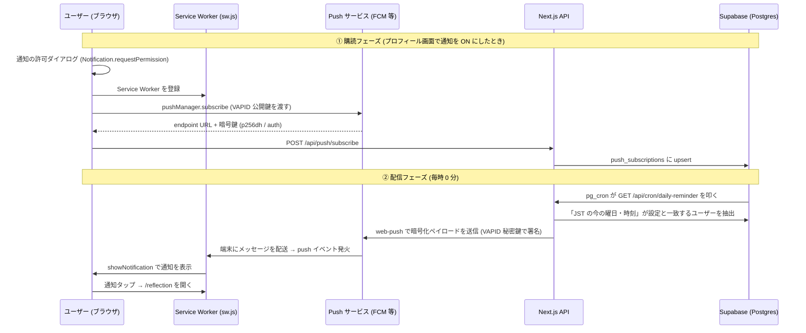

# ReflectHub の通知が届く仕組み — Web Push を初心者向けに徹底解説

ReflectHub には「毎週、自分が選んだ曜日・時刻（日本時間）に振り返りのリマインダーが届く」機能があります。
このドキュメントでは、その通知がユーザーの端末に届くまでの仕組みを、Web Push を初めて触る人にもわかるように解説します。

## 使っている技術スタック

| 役割 | 技術 |
| --- | --- |
| フロントエンド / API | Next.js (App Router) + PWA |
| 通知の受信 | Service Worker (`public/sw.js`) + Web Push API |
| 通知の送信 | `web-push` ライブラリ (Node.js) + VAPID |
| データ保存 | Supabase (PostgreSQL) + RLS |
| 定期実行 | Supabase pg_cron + pg_net + Vault |

## 大前提: Web Push の登場人物は「4 者」いる

Web Push というと「サーバーがブラウザに直接通知を送る」イメージを持ちがちですが、実際には **4 者** が関わります。

```
[アプリのサーバー] → [Push サービス] → [ブラウザ/OS] → [Service Worker] → 通知表示
```

1. **アプリのサーバー** (ReflectHub の Next.js API): 通知を「送りたい」側
2. **Push サービス**: Google (FCM)・Apple・Mozilla などブラウザベンダーが運営する中継サーバー。アプリはここに HTTP リクエストを送るだけ
3. **ブラウザ / OS**: Push サービスと常時つながっていて、メッセージが来たら Service Worker を起こす
4. **Service Worker**: ページを閉じていてもバックグラウンドで動く JavaScript。受け取ったメッセージを通知として表示する

アプリのサーバーは端末に直接触れません。「この端末に届けてください」という宛先 (**エンドポイント URL**) を Push サービスからもらい、そこへ送るのがポイントです。

## 全体の流れ

通知機能は大きく **「① 購読 (受け取る準備)」** と **「② 配信 (実際に送る)」** の 2 フェーズに分かれます。



---

## ① 購読フェーズ: 「通知を受け取る準備」

### 1. ユーザーが曜日・時刻を選んで保存する

プロフィール画面の通知設定 (`src/components/profile/NotificationSettings.tsx`) で、ユーザーは

- **通知する曜日** (OFF / 日〜土)
- **通知する時刻** (0:00〜23:00、日本時間)

を選びます。「保存」を押すと、OFF 以外なら次のステップに進みます。

### 2. ブラウザに通知の許可をもらう

まず対応チェックと許可リクエストを行います (`src/lib/push/client.ts`)。

```ts
// 対応チェック: この 3 つが揃っていないと Web Push は使えない
'serviceWorker' in navigator && 'PushManager' in window && 'Notification' in window

// ユーザーに「通知を許可しますか?」ダイアログを出す
const result = await Notification.requestPermission(); // 'granted' なら OK
```

### 3. Service Worker を登録し、Push サービスを「購読」する

許可が取れたら `/sw.js` を Service Worker として登録し、**Push サービスへの購読** を行います。

```ts
const registration = await navigator.serviceWorker.register('/sw.js');
const subscription = await registration.pushManager.subscribe({
  userVisibleOnly: true,          // 「通知は必ずユーザーに見せる」宣言 (必須)
  applicationServerKey: vapidPublicKey, // VAPID 公開鍵
});
```

`subscribe()` を呼ぶと、ブラウザが裏で Push サービス (Chrome なら FCM) と通信し、**PushSubscription** が返ってきます。中身は 3 つ:

| フィールド | 意味 |
| --- | --- |
| `endpoint` | この端末専用の「宛先 URL」。ここに POST すると端末にメッセージが届く |
| `p256dh` | ペイロード暗号化用の公開鍵 (楕円曲線 P-256) |
| `auth` | 暗号化用の認証シークレット |

`p256dh` と `auth` は、**Push サービス (Google 等) にも通知の中身を読ませない** ためのエンドツーエンド暗号化 (RFC 8291) に使われます。

### 4. サーバーに購読情報を保存する

取得した購読情報を `POST /api/push/subscribe` に送り、Supabase の `push_subscriptions` テーブルに upsert します。

```sql
CREATE TABLE push_subscriptions (
  id UUID PRIMARY KEY,
  user_id UUID NOT NULL,       -- 誰の端末か
  endpoint TEXT NOT NULL,      -- 宛先 URL
  p256dh TEXT NOT NULL,        -- 暗号化用公開鍵
  auth TEXT NOT NULL,          -- 認証シークレット
  is_active BOOLEAN DEFAULT true,
  updated_at TIMESTAMPTZ       -- 「最後に ON にした端末」判定に使う
);
-- (user_id, endpoint) でユニーク → 同じ端末を二重登録しない
```

- **RLS (Row Level Security)** で「自分の行しか読み書きできない」ように保護
- `(user_id, endpoint)` のユニーク制約 + upsert により、同じ端末で何度 ON にしても行は 1 つ
- upsert のたびにトリガーで `updated_at` が更新される → 後述の「最後に ON にした端末に送る」判定に使う

曜日・時刻の設定自体は `user_preferences.notification_preferences` (JSONB) に保存されます。

```json
{ "reminder_weekday": 3, "reminder_hour": 21 }  // 水曜 21:00 (JST)
```

### 保存順序のこだわり (DB と購読状態をずらさない)

ブラウザの購読操作と DB 更新はアトミックにできないため、失敗時に「誤配信」が起きない順序にしています。

- **ON にするとき**: 先に購読を確立 → 成功したら DB に曜日を保存 (購読が無いのに ON が保存される事故を防ぐ)
- **OFF にするとき**: 先に DB を OFF に → その後ブラウザの購読を解除 (解除に失敗しても DB が OFF なので配信されない)

---

## ② 配信フェーズ: 「毎時 0 分に動くリマインダー」

### 5. pg_cron が毎時 0 分に API を叩く

定期実行には **Supabase の pg_cron** を使っています (`database/daily-reminder-pg-cron.sql`)。

```sql
select cron.schedule(
  'daily-reminder',
  '0 * * * *',  -- 毎時 0 分
  $job$
  select net.http_get(
    url := (select decrypted_secret from vault.decrypted_secrets
            where name = 'reminder_endpoint_url'),
    headers := jsonb_build_object('Authorization',
      'Bearer ' || (select decrypted_secret from vault.decrypted_secrets
                    where name = 'cron_secret')),
    timeout_milliseconds := 30000
  );
  $job$
);
```

ポイント:

- **なぜ Vercel Cron ではなく pg_cron?** — 当初は Vercel Cron を使っていましたが、起動時刻が数十分ブレる (11:00 予定が 11:22 起動など) ため「中途半端な時刻に通知が来る」状態でした。pg_cron は Postgres 内部のワーカーが毎分スケジュールを評価するので、**指定した分ちょうど** に動きます。無料プランでも使えて追加コストはゼロ。
- **pg_net** で DB から外部 HTTP (自アプリの API) を叩く
- URL とシークレットは **Supabase Vault** に暗号化保存し、SQL に平文で書かない
- タイムアウトはデフォルト 2 秒 → コールドスタート対策で 30 秒に延長
- ユーザーごとに配信時刻が違うので **毎時** 起動し、「誰に送るか」の判定はアプリ側が行う。対象 0 件の時間帯は即終了するだけ

### 6. API が cron 認証と配信対象の絞り込みを行う

`GET /api/cron/daily-reminder` はまず `Authorization: Bearer ${CRON_SECRET}` を検証します。誰でも叩けると通知を乱発できてしまうためです。

次に `getReminderTargets()` (`src/services/reminderService.ts`) が配信対象を決めます。

1. **JST での「今」の曜日と時刻** を `Intl.DateTimeFormat` で計算 (サーバーのタイムゾーンに依存しない)
2. DB クエリで `reminder_weekday` = 今の曜日、かつ `reminder_hour` = 今の時刻のユーザーを抽出 (JSONB の `->>` 演算子で絞り込み)
3. **同日中に通知済みのユーザーはスキップ** — `last_notified_at` が JST で今日ならスキップ (二重通知防止)
4. 該当ユーザーの有効な (`is_active = true`) 購読を取得し、**`updated_at` の新しい順** に並べる

### 7. 「最後に ON にした端末」1 台だけに送る

1 人が PC・スマホなど複数端末で購読していることがありますが、全端末に送ると冗長です。そこで `sendPushToFirstAvailable()` (`src/services/webPushSender.ts`) は:

- **`updated_at` が最新の端末 (= 最後に通知を ON にした端末) から順に 1 件ずつ試す**
- 1 件成功したらそこで終了 (通知は 1 台にだけ届く)
- 先頭の購読が **失効 (HTTP 404/410)** していた場合のみ、次に新しい端末へフォールバック
- ネットワークエラーや 500 など「失効以外の失敗」なら打ち切り (他端末でも失敗する見込みが高いため)

### 8. web-push ライブラリが暗号化して Push サービスへ送信する

実際の送信は `web-push` ライブラリが担います。裏では次のことが起きています。

1. ペイロード (JSON) を購読時の `p256dh` / `auth` 鍵で **暗号化** (RFC 8291) — Push サービスにも中身は読めない
2. **VAPID 秘密鍵で署名した JWT** をヘッダに付与 (RFC 8292) — 「この通知は正規の ReflectHub サーバーからです」という証明
3. 購読の `endpoint` URL へ HTTP POST → Push サービスが端末へ配送

送るペイロードはこれだけです:

```json
{
  "title": "ReflectHub - 振り返りの時間です",
  "body": "今日の出来事を 1 つだけでも書き留めてみませんか？",
  "url": "/reflection",
  "tag": "reflecthub-daily-reminder"
}
```

#### VAPID とは?

VAPID (Voluntary Application Server Identification) は、**「どのサーバーが通知を送っているか」を Push サービスに証明する公開鍵ペア** です。

- **公開鍵** (`NEXT_PUBLIC_VAPID_PUBLIC_KEY`): ブラウザに渡して購読時に登録。「この鍵の持ち主だけが私に通知を送れる」と紐付く
- **秘密鍵** (`VAPID_PRIVATE_KEY`): サーバーだけが保持。送信時の JWT 署名に使う

鍵が一致しない送信は Push サービスに拒否されるので、endpoint URL が漏れても第三者は通知を送れません。

### 9. Service Worker が通知を表示する

Push サービスからメッセージが届くと、**アプリを開いていなくても** ブラウザが Service Worker を起こし、`push` イベントが発火します (`public/sw.js`)。

```js
self.addEventListener('push', (event) => {
  const payload = event.data.json();
  event.waitUntil(
    self.registration.showNotification(payload.title, {
      body: payload.body,
      icon: payload.icon || '/favicon.ico',
      data: { url: payload.url || '/dashboard' },
      tag: payload.tag,       // 同じ tag の通知は上書きされ、積み上がらない
    }),
  );
});
```

通知をタップすると `notificationclick` イベントで対象 URL (`/reflection`) を開きます。すでにそのページのタブが開いていれば **フォーカス** し、なければ新しく開きます。

```js
self.addEventListener('notificationclick', (event) => {
  event.notification.close();
  // 開いているタブがあれば focus、なければ openWindow
});
```

### 10. 後片付け: 失効処理と重複防止

配信後、cron エンドポイントは以下を行います。

- **失効した購読 (404/410) を `is_active = false` に更新** — アンインストールや購読期限切れの端末には二度と送らない
  - 注意: **401 は失効扱いにしない**。401 はサーバー側の VAPID 設定ミスの可能性が高く、失効扱いにすると鍵ミス 1 つで全ユーザーの購読が無効化されてしまうため (RFC 8030 では 404/410 のみが購読失効を意味する)
- **配信成功したユーザーの `last_notified_at` を更新** — 同日中の再通知を防ぐ
- 対象がいたのに **1 件も成功しなかった場合は HTTP 500 を返す** — VAPID 設定ミスなどのシステム障害を監視で検知できるようにする

---

## iOS (iPhone / iPad) の注意点

iOS では **ホーム画面に追加した PWA でのみ** Web Push を受け取れます (iOS 16.4 以降)。Safari のタブのままでは通知は届きません。そのため設定画面では、iOS ユーザーに「共有ボタン → ホーム画面に追加」の手順を案内しています。

## まとめ: 通知が届くまでの 10 ステップ

1. ユーザーが曜日・時刻を選んで保存
2. ブラウザの通知許可を取得
3. Service Worker 登録 + Push サービスを購読 (endpoint と暗号鍵をもらう)
4. 購読情報を Supabase に保存
5. pg_cron が毎時 0 分に配信 API を叩く
6. API が「JST の今の曜日・時刻」に一致するユーザーを抽出 (通知済みはスキップ)
7. 最後に ON にした端末 1 台を選ぶ (失効時のみフォールバック)
8. web-push が暗号化 + VAPID 署名して Push サービスへ POST
9. Service Worker の `push` イベントが通知を表示、タップで `/reflection` へ
10. 失効購読の無効化と `last_notified_at` 更新で後片付け

## 関連ファイル

| ファイル | 役割 |
| --- | --- |
| `src/components/profile/NotificationSettings.tsx` | 通知設定 UI (曜日・時刻の選択、購読の ON/OFF) |
| `src/lib/push/client.ts` | ブラウザ側の購読処理 (許可取得・subscribe・解除) |
| `public/sw.js` | Service Worker (push 受信・通知表示・クリック処理) |
| `src/app/api/push/subscribe/route.ts` | 購読情報の保存 API |
| `src/app/api/preferences/route.ts` | 曜日・時刻設定の保存 API |
| `src/app/api/cron/daily-reminder/route.ts` | 配信ジョブ本体 (cron から呼ばれる) |
| `src/services/reminderService.ts` | 配信対象の抽出・重複防止・失効処理 |
| `src/services/webPushSender.ts` | web-push ラッパー (VAPID 設定・失効判定・フォールバック) |
| `database/push-subscriptions-and-preferences.sql` | テーブル定義 (RLS・トリガー含む) |
| `database/daily-reminder-pg-cron.sql` | pg_cron ジョブ定義 (Vault・pg_net) |
