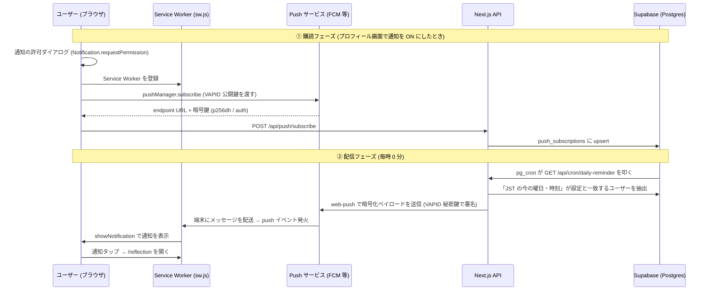

# ReflectHub の PWA と通知の仕組み — Web Push を初心者向けに徹底解説

ReflectHub には「毎週、自分が選んだ曜日・時刻（日本時間）に振り返りのリマインダーが届く」機能があります。
この通知は単体で成り立っているわけではなく、**PWA (Progressive Web App) の仕組みの上に載っています**。特に iPhone / iPad では「アプリをホーム画面に追加する」ことが通知を受け取る前提条件です。

そこでこのドキュメントは、次の 3 部構成で、Web Push も PWA も初めての人にわかるように解説します。

- **第 1 部: PWA とは何か** — アプリらしさを支える 3 つの技術
- **第 2 部: なぜ通知に PWA が必要なのか** — 両者をつなぐ橋渡し
- **第 3 部: 通知が届く仕組み** — 購読から配信・表示まで

## 使っている技術スタック

| 役割 | 技術 |
| --- | --- |
| フロントエンド / API | Next.js (App Router) |
| アプリ化 (PWA) | Web App Manifest + Service Worker |
| オフライン対応 | Service Worker のキャッシュ戦略 (`public/sw.js`) |
| 通知の受信 | Service Worker + Web Push API |
| 通知の送信 | `web-push` ライブラリ (Node.js) + VAPID |
| データ保存 | Supabase (PostgreSQL) + RLS |
| 定期実行 | Supabase pg_cron + pg_net + Vault |

Manifest と Service Worker が **PWA と通知の両方の土台** になっている点に注目してください。これが本記事の一番のポイントです。

---

# 第 1 部: PWA とは何か

**PWA (Progressive Web App)** は、ふつうの Web サイトに「アプリらしさ」を足す技術の総称です。App Store や Google Play を通さず、Web の URL からそのままホーム画面にインストールでき、オフラインでも動き、通知も受け取れます。

PWA を支えるのは主に次の 3 つです。

1. **Web App Manifest** — アプリの自己紹介ファイル
2. **Service Worker** — 裏で常駐するスクリプト
3. **HTTPS** — 必須の前提 (Service Worker は https でしか動かない)

## ① Web App Manifest — アプリの「設定票」

`public/manifest.json` が、OS に「このサイトをアプリとして扱うときの見た目・振る舞い」を伝えます。ReflectHub の内容から抜粋します。

```json
{
  "name": "ReflectHub - 3分で始める週次振り返り",
  "short_name": "ReflectHub",       // ホーム画面のアイコン下に出る短い名前
  "start_url": "/dashboard",         // アプリ起動時に開くページ
  "scope": "/",
  "display": "standalone",           // ブラウザのアドレスバーを隠し、アプリ風に起動
  "theme_color": "#0a0a0a",          // OS のタイトルバー等の色
  "background_color": "#ffffff",     // 起動時スプラッシュの背景色
  "icons": [ /* 192〜512px + maskable */ ],
  "shortcuts": [ /* 長押しメニューの「新しい振り返り」等 */ ]
}
```

押さえておきたい項目:

- **`display: "standalone"`** — これが「アプリらしさ」の核。ブラウザの UI (アドレスバー・タブ) を消して、独立したアプリウィンドウとして起動します。
- **`icons` の `maskable`** — Android の丸型・角丸などデバイスごとのアイコン形状に切り抜かれても崩れない専用アイコン。ReflectHub は `icon-maskable-512.png` を別に用意しています。
- **`shortcuts`** — アイコン長押しで出るクイックメニュー (「新しい振り返り」「ダッシュボード」)。

この manifest は `src/app/layout.tsx` の `manifest: "/manifest.json"` で `<head>` に登録されます。

## ② Service Worker — 裏で常駐する「受付係」

Service Worker (`public/sw.js`) は、**ページを閉じていてもブラウザが管理する別スレッドで動く JavaScript** です。ネットワーク通信を横取りしたり、プッシュ通知を受け取ったりできる、PWA の心臓部です。ReflectHub では 2 つの役割を持っています。

### そもそも Service Worker とは — W3C が定めた Web 標準

Service Worker は「誰かが作った独自の仕組み」ではなく、**W3C が策定した公式の Web 標準 API** です。だから Chrome・Safari・Firefox など各ブラウザが共通で実装しています。

理解のうえで大事なのは、**「スクリプトの中身は自分で書くが、それを Worker として動かすのはブラウザ」** という点です。

| 担当 | 誰がやるか |
| --- | --- |
| SW の中身 (キャッシュ戦略・通知処理) を書く | **開発者** (`public/sw.js`) |
| SW を起動・常駐・再起動し、イベントを発火する | **ブラウザ** |

開発者は「こういう時にこう振る舞え」というルールブックを書いて `navigator.serviceWorker.register()` でブラウザに預けるだけ。いつ起こすか・どう常駐させるかはブラウザが管理します。だから通知はタブを閉じていても届きます。

### 普通の Worker (Web Worker) との違い

名前が似ていますが、目的も寿命も別物です。

| 観点 | Web Worker (普通の Worker) | Service Worker |
| --- | --- | --- |
| 主な用途 | 重い計算を別スレッドで回す | 通信の横取り・キャッシュ・通知 |
| 起動 | ページが `new Worker()` で生成 | ブラウザに登録して常駐させる |
| 寿命 | ページを閉じると**死ぬ** | ページを閉じても**生きる** (必要時に起こされる) |
| タブとの関係 | そのページ専用 (1 対 1) | 同一サイトの全タブで共有 (1 対多) |
| 通信の横取り | できない | **できる** (`fetch` イベント) |
| DOM 操作 | 不可 | 不可 |

ReflectHub がオフライン対応と通知を両立できるのは、この「常駐性」と「通信横取り」という **Service Worker 固有の性質** のおかげです。Web Worker では実現できません (ページが消えれば Worker も消えるため)。

### ライフサイクル: install → activate → 稼働

SW には決まった一生があります。ReflectHub のコードで追ってみます。

**① install — 事前準備**: オフライン起動に最低限必要なファイルを先読みキャッシュします。`event.waitUntil()` は「この Promise が終わるまで install を完了扱いにするな」という指示で、非同期処理は必ずこれで包みます (SW はイベント処理が終わると眠らされるため)。

```js
self.addEventListener('install', (event) => {
  event.waitUntil((async () => {
    const cache = await caches.open(STATIC_CACHE);
    // 1 つの URL が 404 でも install 全体を落とさないよう個別に try/catch
    await Promise.all(PRECACHE_URLS.map((url) => cache.add(url).catch(() => {})));
    await self.skipWaiting();
  })());
});
```

**② activate — 掃除**: 古いバージョンのキャッシュを削除します。`CACHE_VERSION` を上げるとキャッシュ名が変わり、この掃除ロジックで旧版が消えます。**バージョン文字列を上げるだけでキャッシュを一新できる**設計です。

**③ 稼働**: 有効化された SW は普段眠っていて、`fetch` / `push` / `notificationclick` などのイベントが来たときだけ起こされて処理します。

### 更新の仕組み (SW 最大の難所)

SW で一番ハマるのが「更新したのに反映されない」問題です。新しい `sw.js` を検出しても、ブラウザは古い SW がページを制御している間、新 SW を「待機状態 (waiting)」で控えさせ、デフォルトでは全タブを閉じるまで切り替えません。

ReflectHub はこれを 2 つの仕掛けで即時反映しています。

- **`skipWaiting()`** — 「待機列をスキップして今すぐ有効化しろ」
- **`clients.claim()`** — 「有効化されたら、すでに開いているタブも即座に自分の制御下に置く」

登録側 (`src/lib/sw/register.ts`) も、新バージョンを検出したら待機中の SW に `SKIP_WAITING` メッセージを送って更新を後押しします。

```js
// sw.js 側: メッセージを受けたら待機をスキップ
self.addEventListener('message', (event) => {
  if (event.data?.type === 'SKIP_WAITING') self.skipWaiting();
});
```

### 制約とつまずきポイント

| 落とし穴 | ReflectHub での対策 |
| --- | --- |
| 更新が反映されない | `skipWaiting()` + `clients.claim()` + `SKIP_WAITING` メッセージ |
| 非同期処理が途中で切れる | `event.waitUntil()` で必ず包む |
| DOM を触れずエラー | SW は DOM 不可。ページとは `postMessage` で通信 |
| HTTPS でしか動かない | 本番は https (開発は localhost が例外) |
| 開発中に古い画面が出る | 開発環境では登録しない (`isProd` ガード) |

以上を踏まえて、ReflectHub の SW が担う 2 つの役割を見ていきます。

**役割 A: オフライン対応 (キャッシュ戦略)**

`fetch` イベントで通信を横取りし、リクエストの種類ごとに戦略を変えています。

| 対象 | 戦略 | ねらい |
| --- | --- | --- |
| 静的アセット (アイコン・JS・CSS) | Stale-While-Revalidate | キャッシュを即返しつつ裏で更新。表示が速い |
| HTML ページ | Network-First | 最新を優先、オフライン時のみキャッシュへ。認証ページの不整合を防ぐ |
| API (`/api/*`) | キャッシュしない | 常にネットワーク。古いデータを見せない |

これにより電波が無くてもアプリの外枠が起動します。

**役割 B: プッシュ通知の受信**

同じ `sw.js` が `push` イベントで通知を表示し、`notificationclick` でアプリを開きます。詳細は第 3 部で扱いますが、**キャッシュも通知も 1 つの Service Worker が担っている**ことを覚えておいてください。

登録は `src/lib/sw/register.ts` が担当し、次の配慮がされています。

- **本番環境でのみ登録** (開発時は Next.js の HMR と競合し、キャッシュ由来の不可解な挙動を招くため)
- 新バージョンを検出したら `SKIP_WAITING` を送って自動更新

## ③ インストール導線 — ブラウザ差の吸収がいちばんの難所

「インストールできますよ」とユーザーに促す UI は、PWA で最も厄介な部分です。**ブラウザによってやり方が全く違う**からです。ReflectHub は `src/hooks/useInstallPrompt.ts` で吸収しています。

**Chrome / Edge (Chromium 系) の場合**

ブラウザが `beforeinstallprompt` イベントを自動で発火します。ReflectHub はこれを `preventDefault()` で保持し、自前の「インストール」ボタンから任意のタイミングで起動します。

```ts
window.addEventListener('beforeinstallprompt', (e) => {
  e.preventDefault();        // ブラウザ標準の表示を止める
  setDeferredPrompt(e);      // イベントを保存しておく
});
// ユーザーがボタンを押したら → deferredPrompt.prompt()
```

**iOS / iPadOS (Safari) の場合**

`beforeinstallprompt` が**そもそも来ません**。iOS は JS からインストールを起動できず、ユーザーが手動で「共有ボタン → ホーム画面に追加」する必要があります。そこで `src/components/common/InstallPrompt.tsx` は、iOS を検出したら**手順を絵つきで案内する UI** に切り替えます。

iOS 判定 (`src/lib/pwa/standalone.ts`) には一工夫あり、iPadOS 13+ は UA が "Macintosh" を名乗るため、`maxTouchPoints > 1` (タッチ対応か) を併用して見分けています。

**共通の配慮**

- 一度「あとで」を押されたら **14 日間のクールダウン** (localStorage 記録) で再表示を抑制。しつこくしない。
- すでに standalone 起動済み (インストール済み) なら UI を一切出さない。

---

# 第 2 部: なぜ通知に PWA が必要なのか

ここが本記事の橋渡しです。「通知の記事になぜ PWA が出てくるの?」という疑問に答えます。理由は 2 つあります。

## 理由 1: Service Worker が両者の共通土台

**プッシュ通知は Service Worker が無いと物理的に成立しません。** そして Service Worker は前述のとおり PWA の 3 本柱の 1 つです。つまり通知機能は、PWA の一部を必ず使うことになります。

実際、通知を購読する処理 (`src/lib/push/client.ts`) は、その第一歩として Service Worker を登録しています。

```ts
export async function subscribeToPush(vapidPublicKey) {
  const registration = await registerServiceWorker();  // ← まず SW を登録
  await navigator.serviceWorker.ready;
  const subscription = await registration.pushManager.subscribe({ ... });
  // ...
}
```

「通知を受け取る = Service Worker を登録する = PWA の一部を有効にする」という関係で、**通知は PWA から切り離せない**のです。ReflectHub で `sw.js` が「キャッシュ」と「通知」を兼ねているのも、この必然の表れです。

## 理由 2: iOS では PWA インストールが通知の「必須条件」

これは実装でハマりやすい重要ポイントです。**iOS (iPhone / iPad) では、ホーム画面に追加した PWA でしか Web Push を受け取れません** (iOS 16.4 以降)。Safari のタブで開いているだけでは、どれだけ設定しても通知は一切来ません。

この制約が UI 設計に直接表れています。通知設定画面 (`src/components/profile/NotificationSettings.tsx`) は、未インストールのユーザーに対し、OS によって案内の温度感を変えます。

```tsx
{isIOS ? (
  // iOS: 通知には「必須」なので amber で強調
  <p>📱 通知を受け取るにはインストールが必要です</p>
) : (
  // Android / PC: 任意なので gray で「おすすめ」
  <p>📱 通知を受け取るならアプリのインストール（PWA）がおすすめです</p>
)}
```

コード側の意図も明快です。`src/lib/pwa/standalone.ts` の冒頭コメントは、PWA 判定関数が**通知のために存在する**ことを明言しています。

```
Web Push は Service Worker を必要とし、特に iOS/iPadOS では
「ホーム画面に追加した PWA (standalone)」でのみ通知を受け取れる。
通知設定 UI やインストール促し UI で、この状態に応じた案内を出すために使う。
```

**まとめると**: PWA 化は、iOS で通知を動かすための前提条件です。だから ReflectHub は「まずインストールを促し、その上で通知を設定させる」導線になっています。この土台を理解した上で、いよいよ通知の中身に進みます。

---

# 第 3 部: 通知が届く仕組み

## 大前提: Web Push の登場人物は「4 者」いる

Web Push というと「サーバーがブラウザに直接通知を送る」イメージを持ちがちですが、実際には **4 者** が関わります。

```
[アプリのサーバー] → [Push サービス] → [ブラウザ/OS] → [Service Worker] → 通知表示
```

1. **アプリのサーバー** (ReflectHub の Next.js API): 通知を「送りたい」側
2. **Push サービス**: Google (FCM)・Apple・Mozilla などブラウザベンダーが運営する中継サーバー。アプリはここに HTTP リクエストを送るだけ
3. **ブラウザ / OS**: Push サービスと常時つながっていて、メッセージが来たら Service Worker を起こす
4. **Service Worker**: 第 1 部で登場した、ページを閉じても動くスクリプト。受け取ったメッセージを通知として表示する

アプリのサーバーは端末に直接触れません。「この端末に届けてください」という宛先 (**エンドポイント URL**) を Push サービスからもらい、そこへ送るのがポイントです。

## 全体の流れ

通知機能は大きく **「① 購読 (受け取る準備)」** と **「② 配信 (実際に送る)」** の 2 フェーズに分かれます。



## ① 購読フェーズ: 「通知を受け取る準備」

### 1. ユーザーが曜日・時刻を選んで保存する

プロフィール画面の通知設定 (`src/components/profile/NotificationSettings.tsx`) で、ユーザーは

- **通知する曜日** (OFF / 日〜土)
- **通知する時刻** (0:00〜23:00、日本時間)

を選びます。「保存」を押すと、OFF 以外なら次のステップに進みます。

### 2. ブラウザに通知の許可をもらう

まず対応チェックと許可リクエストを行います (`src/lib/push/client.ts`)。

```ts
// 対応チェック: この 3 つが揃っていないと Web Push は使えない
'serviceWorker' in navigator && 'PushManager' in window && 'Notification' in window

// ユーザーに「通知を許可しますか?」ダイアログを出す
const result = await Notification.requestPermission(); // 'granted' なら OK
```

### 3. Service Worker を登録し、Push サービスを「購読」する

許可が取れたら `/sw.js` を Service Worker として登録し、**Push サービスへの購読** を行います。第 2 部で触れたとおり、通知はここで PWA の Service Worker を使います。

```ts
const registration = await navigator.serviceWorker.register('/sw.js');
const subscription = await registration.pushManager.subscribe({
  userVisibleOnly: true,          // 「通知は必ずユーザーに見せる」宣言 (必須)
  applicationServerKey: vapidPublicKey, // VAPID 公開鍵
});
```

`subscribe()` を呼ぶと、ブラウザが裏で Push サービス (Chrome なら FCM) と通信し、**PushSubscription** が返ってきます。中身は 3 つ。

| フィールド | 意味 |
| --- | --- |
| `endpoint` | この端末専用の「宛先 URL」。ここに POST すると端末にメッセージが届く |
| `p256dh` | ペイロード暗号化用の公開鍵 (楕円曲線 P-256) |
| `auth` | 暗号化用の認証シークレット |

`p256dh` と `auth` は、**Push サービス (Google 等) にも通知の中身を読ませない** ためのエンドツーエンド暗号化 (RFC 8291) に使われます。

### 4. サーバーに購読情報を保存する

取得した購読情報を `POST /api/push/subscribe` に送り、Supabase の `push_subscriptions` テーブルに upsert します。

```sql
CREATE TABLE push_subscriptions (
  id UUID PRIMARY KEY,
  user_id UUID NOT NULL,       -- 誰の端末か
  endpoint TEXT NOT NULL,      -- 宛先 URL
  p256dh TEXT NOT NULL,        -- 暗号化用公開鍵
  auth TEXT NOT NULL,          -- 認証シークレット
  is_active BOOLEAN DEFAULT true,
  updated_at TIMESTAMPTZ       -- 「最後に ON にした端末」判定に使う
);
-- (user_id, endpoint) でユニーク → 同じ端末を二重登録しない
```

- **RLS (Row Level Security)** で「自分の行しか読み書きできない」ように保護
- `(user_id, endpoint)` のユニーク制約 + upsert により、同じ端末で何度 ON にしても行は 1 つ
- upsert のたびにトリガーで `updated_at` が更新される → 後述の「最後に ON にした端末に送る」判定に使う

曜日・時刻の設定自体は `user_preferences.notification_preferences` (JSONB) に保存されます。

```json
{ "reminder_weekday": 3, "reminder_hour": 21 }  // 水曜 21:00 (JST)
```

### 保存順序のこだわり (DB と購読状態をずらさない)

ブラウザの購読操作と DB 更新はアトミックにできないため、失敗時に「誤配信」が起きない順序にしています。

- **ON にするとき**: 先に購読を確立 → 成功したら DB に曜日を保存 (購読が無いのに ON が保存される事故を防ぐ)
- **OFF にするとき**: 先に DB を OFF に → その後ブラウザの購読を解除 (解除に失敗しても DB が OFF なので配信されない)

## ② 配信フェーズ: 「毎時 0 分に動くリマインダー」

### 5. pg_cron が毎時 0 分に API を叩く

定期実行には **Supabase の pg_cron** を使っています (`database/daily-reminder-pg-cron.sql`)。

```sql
select cron.schedule(
  'daily-reminder',
  '0 * * * *',  -- 毎時 0 分
  $job$
  select net.http_get(
    url := (select decrypted_secret from vault.decrypted_secrets
            where name = 'reminder_endpoint_url'),
    headers := jsonb_build_object('Authorization',
      'Bearer ' || (select decrypted_secret from vault.decrypted_secrets
                    where name = 'cron_secret')),
    timeout_milliseconds := 30000
  );
  $job$
);
```

ポイント:

- **なぜ Vercel Cron ではなく pg_cron?** — 当初は Vercel Cron を使っていましたが、起動時刻が数十分ブレる (11:00 予定が 11:22 起動など) ため「中途半端な時刻に通知が来る」状態でした。pg_cron は Postgres 内部のワーカーが毎分スケジュールを評価するので、**指定した分ちょうど** に動きます。無料プランでも使えて追加コストはゼロ。
- **pg_net** で DB から外部 HTTP (自アプリの API) を叩く
- URL とシークレットは **Supabase Vault** に暗号化保存し、SQL に平文で書かない
- タイムアウトはデフォルト 2 秒 → コールドスタート対策で 30 秒に延長
- ユーザーごとに配信時刻が違うので **毎時** 起動し、「誰に送るか」の判定はアプリ側が行う。対象 0 件の時間帯は即終了するだけ

### 6. API が cron 認証と配信対象の絞り込みを行う

`GET /api/cron/daily-reminder` はまず `Authorization: Bearer ${CRON_SECRET}` を検証します。誰でも叩けると通知を乱発できてしまうためです。

次に `getReminderTargets()` (`src/services/reminderService.ts`) が配信対象を決めます。

1. **JST での「今」の曜日と時刻** を `Intl.DateTimeFormat` で計算 (サーバーのタイムゾーンに依存しない)
2. DB クエリで `reminder_weekday` = 今の曜日、かつ `reminder_hour` = 今の時刻のユーザーを抽出 (JSONB の `->>` 演算子で絞り込み)
3. **同日中に通知済みのユーザーはスキップ** — `last_notified_at` が JST で今日ならスキップ (二重通知防止)
4. 該当ユーザーの有効な (`is_active = true`) 購読を取得し、**`updated_at` の新しい順** に並べる

### 7. 「最後に ON にした端末」1 台だけに送る

1 人が PC・スマホなど複数端末で購読していることがありますが、全端末に送ると冗長です。そこで `sendPushToFirstAvailable()` (`src/services/webPushSender.ts`) は次のように動きます。

- **`updated_at` が最新の端末 (= 最後に通知を ON にした端末) から順に 1 件ずつ試す**
- 1 件成功したらそこで終了 (通知は 1 台にだけ届く)
- 先頭の購読が **失効 (HTTP 404/410)** していた場合のみ、次に新しい端末へフォールバック
- ネットワークエラーや 500 など「失効以外の失敗」なら打ち切り (他端末でも失敗する見込みが高いため)

### 8. web-push ライブラリが暗号化して Push サービスへ送信する

実際の送信は `web-push` ライブラリが担います。裏では次のことが起きています。

1. ペイロード (JSON) を購読時の `p256dh` / `auth` 鍵で **暗号化** (RFC 8291) — Push サービスにも中身は読めない
2. **VAPID 秘密鍵で署名した JWT** をヘッダに付与 (RFC 8292) — 「この通知は正規の ReflectHub サーバーからです」という証明
3. 購読の `endpoint` URL へ HTTP POST → Push サービスが端末へ配送

送るペイロードはこれだけです。

```json
{
  "title": "ReflectHub - 振り返りの時間です",
  "body": "今日の出来事を 1 つだけでも書き留めてみませんか？",
  "url": "/reflection",
  "tag": "reflecthub-daily-reminder"
}
```

#### VAPID とは?

VAPID (Voluntary Application Server Identification) は、**「どのサーバーが通知を送っているか」を Push サービスに証明する公開鍵ペア** です。

- **公開鍵** (`NEXT_PUBLIC_VAPID_PUBLIC_KEY`): ブラウザに渡して購読時に登録。「この鍵の持ち主だけが私に通知を送れる」と紐付く
- **秘密鍵** (`VAPID_PRIVATE_KEY`): サーバーだけが保持。送信時の JWT 署名に使う

鍵が一致しない送信は Push サービスに拒否されるので、endpoint URL が漏れても第三者は通知を送れません。

### 9. Service Worker が通知を表示する

Push サービスからメッセージが届くと、**アプリを開いていなくても** ブラウザが Service Worker を起こし、`push` イベントが発火します (`public/sw.js`)。ここで、第 1 部でオフラインキャッシュを担っていたのと同じ Service Worker が、今度は通知の表示を担当します。

```js
self.addEventListener('push', (event) => {
  const payload = event.data.json();
  event.waitUntil(
    self.registration.showNotification(payload.title, {
      body: payload.body,
      icon: payload.icon || '/favicon.ico',
      data: { url: payload.url || '/dashboard' },
      tag: payload.tag,       // 同じ tag の通知は上書きされ、積み上がらない
    }),
  );
});
```

通知をタップすると `notificationclick` イベントで対象 URL (`/reflection`) を開きます。すでにそのページのタブが開いていれば **フォーカス** し、なければ新しく開きます。

```js
self.addEventListener('notificationclick', (event) => {
  event.notification.close();
  // 開いているタブがあれば focus、なければ openWindow
});
```

### 10. 後片付け: 失効処理と重複防止

配信後、cron エンドポイントは以下を行います。

- **失効した購読 (404/410) を `is_active = false` に更新** — アンインストールや購読期限切れの端末には二度と送らない
  - 注意: **401 は失効扱いにしない**。401 はサーバー側の VAPID 設定ミスの可能性が高く、失効扱いにすると鍵ミス 1 つで全ユーザーの購読が無効化されてしまうため (RFC 8030 では 404/410 のみが購読失効を意味する)
- **配信成功したユーザーの `last_notified_at` を更新** — 同日中の再通知を防ぐ
- 対象がいたのに **1 件も成功しなかった場合は HTTP 500 を返す** — VAPID 設定ミスなどのシステム障害を監視で検知できるようにする

---

## まとめ: PWA から通知まで一気通貫

PWA と通知は、Service Worker という共通の土台でつながっています。全体を振り返ると次のとおりです。

**PWA が土台を用意する (第 1〜2 部)**

1. Manifest でアプリの見た目・起動方法を定義
2. Service Worker を登録 (オフラインキャッシュ + 通知受信を兼ねる)
3. ブラウザ差を吸収してインストールを促す (iOS は手動案内)
4. iOS では PWA インストールが通知の必須条件

**その上で通知が動く (第 3 部)**

5. ユーザーが曜日・時刻を選び、通知許可を取得
6. Service Worker 登録 + Push サービスを購読 (endpoint と暗号鍵を取得)
7. 購読情報を Supabase に保存
8. pg_cron が毎時 0 分に配信 API を起動
9. 「JST の今の曜日・時刻」に一致するユーザーを抽出 (通知済みはスキップ)
10. 最後に ON にした端末 1 台へ、web-push が暗号化 + VAPID 署名して送信
11. Service Worker が通知を表示、タップで `/reflection` へ
12. 失効購読の無効化と `last_notified_at` 更新で後片付け

## 関連ファイル

| ファイル | 役割 |
| --- | --- |
| `public/manifest.json` | PWA の定義 (アプリ名・アイコン・起動方法) |
| `src/lib/pwa/standalone.ts` | standalone / iOS 判定 (通知可否の見極めに使う) |
| `src/hooks/useInstallPrompt.ts` | インストール判定・ブラウザ差の吸収・クールダウン |
| `src/components/common/InstallPrompt.tsx` | インストール促し UI (Chromium はボタン / iOS は手順案内) |
| `src/lib/sw/register.ts` | Service Worker の登録 (本番のみ・自動更新) |
| `public/sw.js` | Service Worker (オフラインキャッシュ + push 受信・通知表示・クリック処理) |
| `src/components/profile/NotificationSettings.tsx` | 通知設定 UI (曜日・時刻の選択、購読の ON/OFF、iOS 案内) |
| `src/lib/push/client.ts` | ブラウザ側の購読処理 (許可取得・subscribe・解除) |
| `src/app/api/push/subscribe/route.ts` | 購読情報の保存 API |
| `src/app/api/preferences/route.ts` | 曜日・時刻設定の保存 API |
| `src/app/api/cron/daily-reminder/route.ts` | 配信ジョブ本体 (cron から呼ばれる) |
| `src/services/reminderService.ts` | 配信対象の抽出・重複防止・失効処理 |
| `src/services/webPushSender.ts` | web-push ラッパー (VAPID 設定・失効判定・フォールバック) |
| `database/push-subscriptions-and-preferences.sql` | テーブル定義 (RLS・トリガー含む) |
| `database/daily-reminder-pg-cron.sql` | pg_cron ジョブ定義 (Vault・pg_net) |

## 参考文献

Service Worker は W3C が策定した公式の Web 標準であり、本記事で扱った技術はいずれも標準仕様に基づいています。一次ソースと定番リファレンスを挙げます。

**Service Worker / PWA の一次ソース**

- W3C「Service Workers」仕様 — https://www.w3.org/TR/service-workers/
- W3C 編集版 (最新の生ドラフト) — https://w3c.github.io/ServiceWorker/
- MDN Web Docs: Service Worker API — https://developer.mozilla.org/ja/docs/Web/API/Service_Worker_API
- MDN: Using Service Workers (実装チュートリアル) — https://developer.mozilla.org/en-US/docs/Web/API/Service_Worker_API/Using_Service_Workers
- W3C: Web App Manifest — https://www.w3.org/TR/appmanifest/
- Fetch Standard (WHATWG) — https://fetch.spec.whatwg.org/

**通知 (Web Push) 関連の一次ソース**

- W3C: Push API — https://www.w3.org/TR/push-api/
- Notifications API (WHATWG) — https://notifications.spec.whatwg.org/
- RFC 8030: Generic Event Delivery Using HTTP Push — https://datatracker.ietf.org/doc/html/rfc8030
- RFC 8291: Message Encryption for Web Push — https://datatracker.ietf.org/doc/html/rfc8291
- RFC 8292: VAPID for Web Push — https://datatracker.ietf.org/doc/html/rfc8292

**実務向けの解説・対応状況**

- web.dev (Google): Service workers — https://web.dev/learn/pwa/service-workers/
- Can I use: Service Workers (ブラウザ対応状況) — https://caniuse.com/serviceworkers

> 補足: Service Worker は Chrome 40 (2015) で初搭載。Safari は iOS 11.3 (2018) で Service Worker に対応し、Web Push は iOS 16.4 (2023) でようやく対応した。本記事で「iOS では PWA インストールが通知の必須条件」としているのは、この Safari の対応事情が背景にある。
